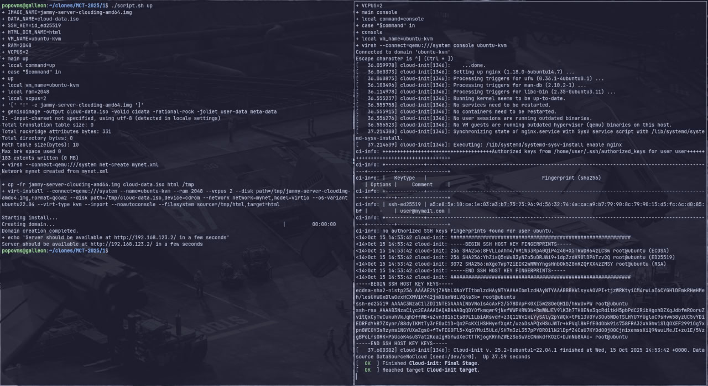
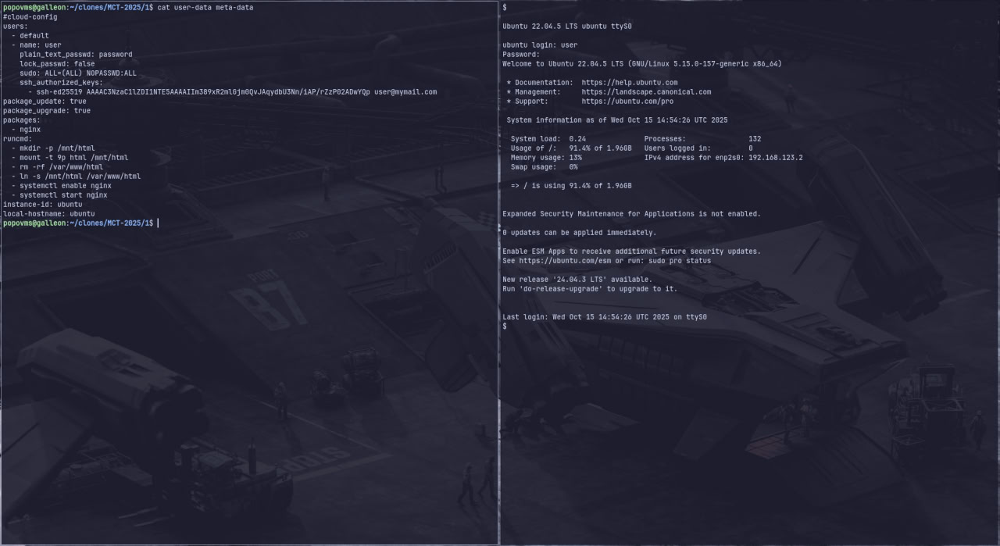
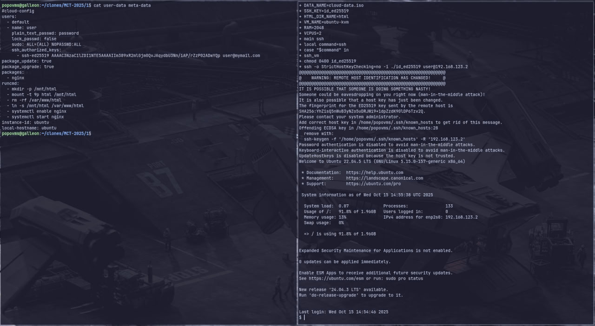
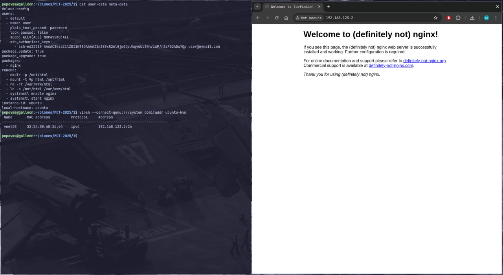

# Задание №1 по курсу "Современные облачные технологии" 2025

## Основные

### Успешная настройка окружения и запуск ВМ

### Корректная работа логина по паролю

### Корректная работа логина по ssh

### Корректная работа nginx

## Дополнительные

### Создайте виртуальную сеть самостоятельно

Конфигурация виртуальной сети определяется файлом [mynet.xml](mynet.xml):
- название сети - `mynet`
- настройка маршрутизации - динамический PAT с диапазоном портов (1024, 65535)
- название интерфейса в хостовой системе - `virbr1`
- MAC интерфейса в хостовой системе - `0a:0a:f4:bb:ec:cf`
- Подсеть - `192.168.123.0/24`
- Gateway - `192.168.123.1`
- IP-адрес ВМ - `192.168.123.2` (единственный адрес в пуле DHCP)

Сама виртуальная сеть создается командой `virsh --connect=qemu:///system net-create mynet.xml`

### Напишите скрипт для сборки и запуска ВМ

См. [скрипт](script.sh). Для всех параметров есть значения по-умолчанию.

> Перед созданием ВМ файлы образа системы, образа cloud-init и директория html копируются в /tmp.

Команды:
- `./script.sh up myvm 1024 1` - запуск ВМ
- `./script.sh ssh` - логин по SSH пользователем `user`
- `./script.sh console myvm` - консоль гипервизора
- `./script.sh down myvm` - удаление ВМ
- `./script.sh clear-tmp` - удаление артефактов запуска ВМ в `/tmp` (полезно, если произошла ошибка при запуске/удалении)

Для содержимого веб-сервера нет соответствующего параметра скрипта, оно всегда берется из [html](html).
